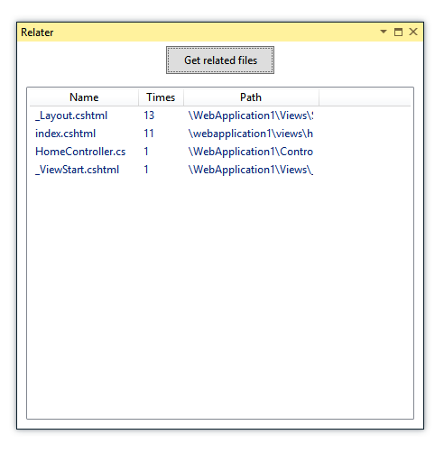

# Relater (pre-alpha / proof of concept)

Relater is a small Visual Studio Plugin, that monitors how you nagivate to find files related to other files.

It then gives you a little tool window, that you can use to quickly switch between the files.

BEHOLD THE GLORY:

Look at that nice "Get related files" button? I know it looks cool, but the idea is to get rid of that.

This project aims to find out if it is useful to navigate using your history of navigating. It is my first Visual Studio Extension, and the version you are looking at is created in two hours.

## How to test it
You need the Visual Studio 2013 SDK. Then open the project, it should build, and it will start a special Visual Studio process.
If you then want to install it in your real Visual Studio, you can use the output of the Debug folder.
If you don't know what I mean, and how to do this - then this project is properbly in a too early stage for you to use (sorry).

## Wanna help?

Catch me on the tweets on [@jesperbjensen](http://twitter.com/jesperbjensen) and lets talk. I hope someone more competent than me, can help me turn this little beast into a glorious magic unicorn.